# Microblog DevOps Platform

A production-style DevOps portfolio project demonstrating the complete journey from a simple Flask application to a containerized, Kubernetes-based platform with automated CI/CD, GitOps deployment, automatic image updates, ingress, monitoring, and observability.

The project was built incrementally and intentionally includes the troubleshooting and infrastructure work required to make the platform reliable in a local Kubernetes environment.

---

## 🚀 Project Overview

The **Microblog DevOps Platform** is a Flask application deployed on Kubernetes and managed using a GitOps workflow.

### Core flow

```text
Developer
   │
   │ git push
   ▼
GitHub Repository
   │
   ▼
GitHub Actions
   │
   ├── Build application
   ├── Build Docker image
   ├── Tag image with Git commit SHA
   └── Push image to GHCR
   │
   ▼
GitHub Container Registry
   │
   ▼
Argo CD Image Updater
   │
   ├── Detect new image
   └── Update deployment image
   │
   ▼
Argo CD
   │
   ├── Sync desired state
   └── Self-heal / prune
   │
   ▼
Kubernetes / Minikube
   │
   ├── Flask
   ├── PostgreSQL
   ├── Redis
   ├── NGINX Ingress
   ├── Prometheus
   └── Grafana
```

The result is a complete local DevOps pipeline where a code change can travel from Git commit to a new container image and finally to a running Kubernetes workload.

---

## 🧰 Technology Stack

| Area | Technology |
|---|---|
| Application | Python, Flask |
| Containerization | Docker |
| Local development | Docker Compose |
| CI/CD | GitHub Actions |
| Container Registry | GitHub Container Registry (GHCR) |
| Orchestration | Kubernetes |
| Local Kubernetes | Minikube |
| Package management | Helm |
| GitOps | Argo CD |
| Image automation | Argo CD Image Updater |
| Ingress | NGINX Ingress Controller |
| Metrics | Prometheus |
| Visualization | Grafana |
| Database | PostgreSQL |
| Cache | Redis |
| Environment | WSL2 / Linux |

---

# 📁 Repository Structure

```text
microblog-devops/
│
├── .github/
│   └── workflows/
│       └── ci.yml
│
├── app/
│   ├── app.py
│   └── requirements.txt
│
├── helm/
│   └── microblog/
│       ├── Chart.yaml
│       ├── values.yaml
│       └── templates/
│
├── k8s/
│   ├── deployment.yaml
│   ├── service.yaml
│   ├── postgres.yaml
│   ├── redis.yaml
│   ├── ingress.yaml
│   └── ...
│
├── monitoring/
│   ├── prometheus/
│   ├── grafana/
│   └── argocd-ingress.yaml
│
├── scripts/
│   └── ...
│
├── Dockerfile
├── docker-compose.yml
├── .gitignore
└── README.md
```

---

# 🏗️ Application

The application is a lightweight Flask service created specifically to demonstrate DevOps practices.

Example response:

```json
{
  "message": "Microblog DevOps Platform V3-updated once again",
  "visits": 125
}
```

The application exposes endpoints for:

- Application response
- Health checking
- Posts/sample API data
- Prometheus metrics

The `/metrics` endpoint exposes application metrics that are scraped by Prometheus.

---

# 🐳 Docker

The Flask application is containerized using Docker.

The Dockerfile uses a production-oriented container setup and runs the application through Gunicorn.

Example build:

```bash
docker build -t microblog-app .
```

Run locally:

```bash
docker run -d \
  --name microblog-app \
  -p 5000:5000 \
  microblog-app
```

The project also contains a Docker Compose configuration for running the local application stack with PostgreSQL and Redis.

```bash
docker compose up -d
```

---

# 🔄 CI/CD with GitHub Actions

Every push to the repository can trigger the GitHub Actions workflow.

The pipeline is responsible for:

1. Checking out the source code.
2. Building the Docker image.
3. Creating a versioned image tag.
4. Using the Git commit SHA as an immutable image version.
5. Pushing the image to GitHub Container Registry.

Example image:

```text
ghcr.io/prabhat-912/microblog-devops:<git-commit-sha>
```

Using the commit SHA instead of only `latest` makes deployments traceable to an exact source revision.

---

# 📦 GitHub Container Registry

Docker images are stored in GHCR.

Example:

```text
ghcr.io/prabhat-912/microblog-devops
```

The Kubernetes deployment ultimately runs one of these versioned images.

This provides a clear relationship:

```text
Git Commit
    ↓
Docker Image
    ↓
Image SHA
    ↓
Kubernetes Deployment
```

---

# ☸️ Kubernetes

The application is deployed to a local Minikube Kubernetes cluster.

The platform includes:

- Flask application
- PostgreSQL
- Redis
- Services
- Persistent storage
- NGINX Ingress
- Prometheus
- Grafana
- Argo CD components

Useful verification commands:

```bash
kubectl get nodes
kubectl get namespaces
kubectl get pods -A
kubectl get svc
kubectl get ingress
```

Application pods can be checked with:

```bash
kubectl get pods -l app=flask -o wide
```

Deployment status:

```bash
kubectl rollout status deployment/flask-app
```

---

# 🌐 NGINX Ingress

The application is exposed through NGINX Ingress.

Local hostnames used during the project include:

```text
microblog.test
argocd.test
prometheus.test
grafana.test
```

This provides a more realistic access pattern than exposing every service individually with NodePort.

Example:

```text
Browser
   │
   ▼
NGINX Ingress Controller
   │
   ├── microblog.test  → Flask Service
   ├── argocd.test     → Argo CD
   ├── prometheus.test → Prometheus
   └── grafana.test    → Grafana
```

---

# 🔁 GitOps with Argo CD

Argo CD is used to continuously reconcile the Kubernetes cluster with the desired state stored in Git.

The `microblog-devops` Argo CD application points to the repository's Kubernetes manifests.

Current successful state:

```text
SYNC STATUS:   Synced
HEALTH STATUS: Healthy
```

Argo CD provides:

- Git-based desired state
- Automated synchronization
- Self-healing
- Pruning
- Deployment visibility
- Application health monitoring

---

# 🤖 Argo CD Image Updater

Argo CD Image Updater automates the connection between GHCR and Kubernetes.

The project uses image automation to detect a newly published application image and update the deployed image.

Verification:

```bash
kubectl get imageupdater microblog-image-updater -n argocd
```

Expected state:

```text
READY: True
```

The deployed image can be verified with:

```bash
kubectl get deployment flask-app \
  -o jsonpath='{.spec.template.spec.containers[0].image}'
```

Example:

```text
ghcr.io/prabhat-912/microblog-devops:<commit-sha>
```

---

# 🔥 Automatic Deployment Test

One of the most important project validations was testing the complete automation path.

A source change was committed:

```bash
git add .
git commit -m "test: trigger automatic deployment"
git push origin main
```

The new image was generated using the new Git commit SHA.

Argo CD Image Updater detected the new image.

Argo CD then reconciled the desired state.

Finally, Kubernetes rolled out the new application pods.

Verification:

```bash
kubectl get application microblog-devops -n argocd
```

```text
SYNC STATUS   HEALTH STATUS
Synced        Healthy
```

Then:

```bash
kubectl rollout status deployment/flask-app
```

```text
deployment "flask-app" successfully rolled out
```

This demonstrated the complete GitOps deployment loop.

---

# 📊 Monitoring & Observability

Prometheus is used to collect application metrics.

Grafana is used to visualize them.

The Flask application exposes Prometheus-compatible metrics through `/metrics`.

One of the tracked application metrics is:

```text
app_requests_total
```

This allows request activity to be visualized across the running Flask pods.

---

## Prometheus

Prometheus can query application metrics such as:

```text
app_requests_total
```

The project successfully demonstrated application request metrics being collected from Kubernetes pods.

---

## Grafana

Grafana dashboards visualize the collected Prometheus metrics.

The project includes dashboards for:

- CPU
- Pods
- Application request metrics
- Prometheus-backed visualizations

This provides a basic observability layer over the Kubernetes application.

---

# 🧪 Validation Commands

Useful commands used throughout the project:

### Kubernetes health

```bash
kubectl get nodes
kubectl get pods -A
kubectl get svc
kubectl get namespaces
```

### Application

```bash
kubectl get pods -l app=flask -o wide
kubectl rollout status deployment/flask-app
kubectl get deployment flask-app
```

### Argo CD

```bash
kubectl get pods -n argocd
kubectl get application microblog-devops -n argocd
kubectl get imageupdater microblog-image-updater -n argocd
```

### Deployment image

```bash
kubectl get deployment flask-app \
  -o jsonpath='{.spec.template.spec.containers[0].image}'
```

### Services

```bash
kubectl get svc
```

---

# 🛠️ Troubleshooting Journey

This project was not built as a single clean installation. A significant part of the work involved troubleshooting the local development environment and Kubernetes components.

## 1. Windows Compatibility / Virtualization Issues

The initial environment exposed Windows-level compatibility and virtualization issues while setting up the container and Kubernetes tooling.

The solution involved enabling the required Windows virtualization features and moving toward a Linux-based development environment.

---

## 2. Migration to WSL2

WSL2 was introduced to provide a more reliable Linux environment for Docker and Kubernetes tooling.

The project was subsequently operated from a Linux shell under WSL.

Example working directory:

```text
/mnt/p/microblog-devops
```

This also made Linux-native tools such as:

```bash
kubectl
docker
git
vim
```

more convenient to use.

---

## 3. Docker Desktop Removal

Docker Desktop was initially part of the environment, but the project setup was later simplified by moving away from Docker Desktop and using the WSL/Linux environment directly.

This reduced unnecessary desktop-layer dependencies and made the development environment more transparent.

---

## 4. Docker and Container Troubleshooting

The project involved troubleshooting:

- Docker installation and PATH issues
- Container startup
- Image creation
- Port mapping
- Docker Compose
- PostgreSQL startup
- Redis startup
- Application connectivity

The Flask application was eventually containerized and successfully served through the container runtime.

---

## 5. Kubernetes / Minikube Troubleshooting

Minikube was used as the local Kubernetes cluster.

The environment required troubleshooting around:

- Cluster startup
- Kubernetes API server
- Resource constraints
- Pod scheduling
- Service discovery
- Ingress
- Persistent volumes

Resource consumption was especially important because the local laptop had limited CPU and memory available for the Kubernetes environment.

---

## 6. Metrics Server Troubleshooting

The Kubernetes Metrics Server initially failed to provide metrics.

For example:

```bash
kubectl top nodes
```

returned:

```text
Metrics API not available
```

The Metrics Server addon was enabled and further debugging was performed using:

```bash
kubectl logs -n kube-system deployment/metrics-server
```

TLS handshake timeouts and liveness/readiness behavior were investigated.

This was an important practical Kubernetes troubleshooting exercise because it demonstrated that simply enabling an addon does not guarantee that the API becomes immediately healthy.

---

## 7. Argo CD Troubleshooting

Argo CD initially experienced repository/server communication issues, including errors involving the repo-server connection.

The Argo CD components were inspected using:

```bash
kubectl get pods -n argocd
```

and application state using:

```bash
kubectl get application microblog-devops -n argocd
```

The final state was:

```text
Synced
Healthy
```

---

## 8. Argo CD Image Updater Troubleshooting

The Image Updater initially experienced restart/crash behavior during setup.

The component was investigated through Kubernetes pod status and logs.

After configuration and troubleshooting, the Image Updater reached:

```text
READY: True
```

and successfully detected new images.

---

## 9. Git Working Tree Cleanup

A locally downloaded Argo CD CLI binary appeared as an untracked file:

```text
argocd-cli
```

The binary was approximately 239 MB and was not required in the source repository.

It was therefore added to `.gitignore`:

```gitignore
argocd-cli
```

This keeps local tooling out of version control.

---

# 🧹 Repository Hygiene

The project intentionally avoids committing local/generated artifacts.

Examples include:

```text
argocd-cli
grafana.db
```

The `.gitignore` file is used to keep environment-specific files out of Git.

---

# 📸 Project Screenshots

## Kubernetes Workloads

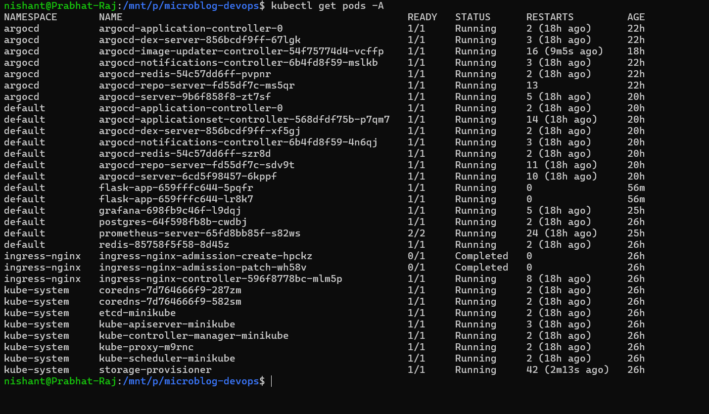

The Kubernetes cluster contains the application, database, cache, monitoring, ingress, and GitOps components.

---

## Argo CD Application

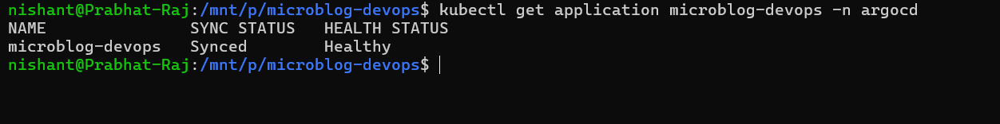

The `microblog-devops` application is shown as **Synced** and **Healthy**.

---

## Argo CD Image Updater

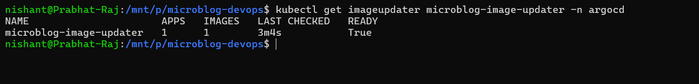

The Image Updater reports one managed application and one managed image with the updater ready.

---

## Deployed Container Image

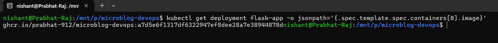

The Kubernetes deployment is running a GHCR image tagged with a Git commit SHA.

---

## Successful Kubernetes Rollout

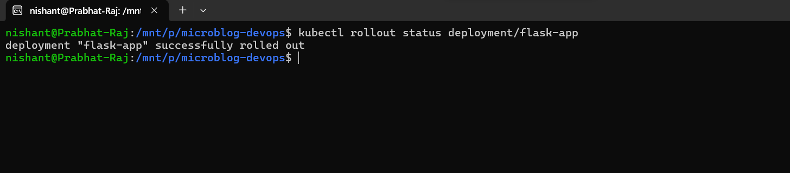

The Flask deployment successfully completes its rollout.

---

## Kubernetes Services and Pods

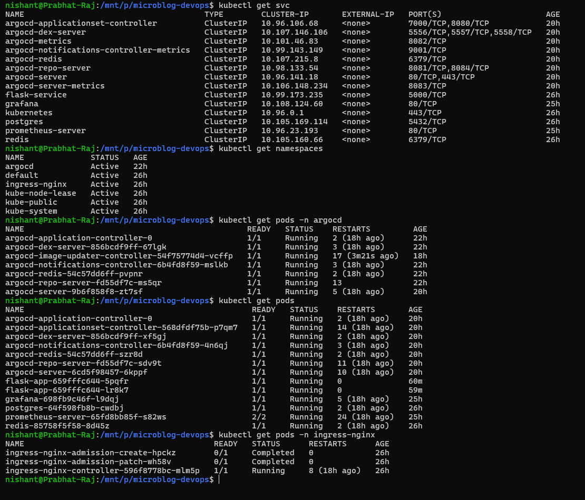

Services and workloads across the Kubernetes namespaces are visible.

---

## Application

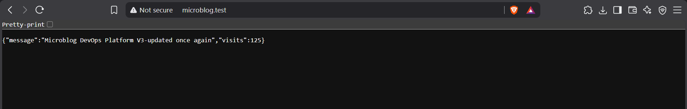

The running Microblog DevOps application is accessible through the local ingress hostname.

---

## Prometheus

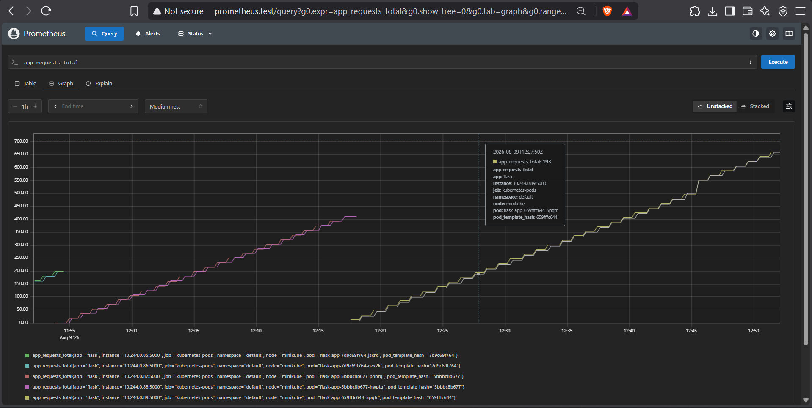

Prometheus is successfully querying the application's request metric.

---

## Grafana

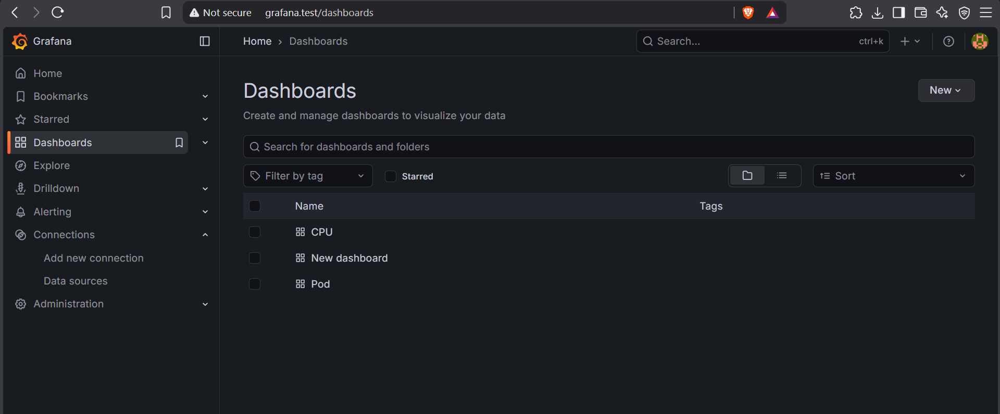

Grafana provides dashboards for monitoring the platform.

---

## Application Request Graph

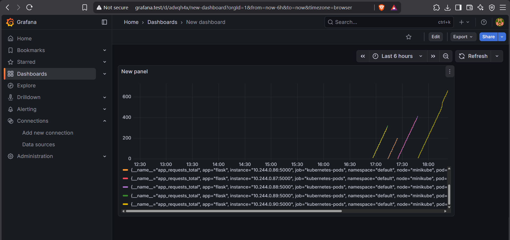

Application request activity is visualized across the Kubernetes pods.

---

## Argo CD UI

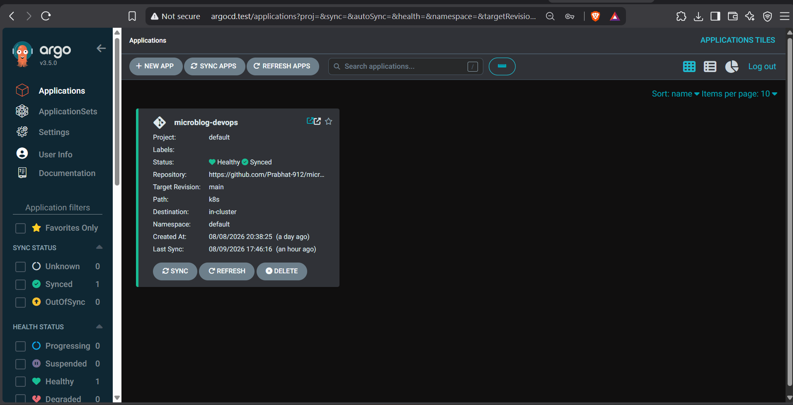

The Argo CD UI provides visibility into the GitOps application's health and synchronization state.

---

## GitHub Repository

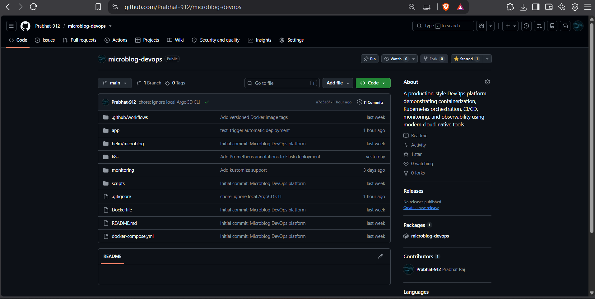

The project source code, CI/CD workflow, Kubernetes manifests, Helm chart, monitoring configuration, and scripts are maintained in GitHub.

---

# 🎯 Key DevOps Concepts Demonstrated

This project demonstrates practical experience with:

- Linux / WSL2 environments
- Git and GitHub
- GitHub Actions
- CI/CD pipelines
- Docker
- Docker Compose
- Container registries
- GitHub Container Registry
- Kubernetes
- Minikube
- Kubernetes Deployments
- Services
- Persistent Volumes
- ConfigMaps / Secrets
- NGINX Ingress
- Helm
- Argo CD
- GitOps
- Argo CD Image Updater
- Automated deployments
- Self-healing
- Prometheus
- Grafana
- Application metrics
- Troubleshooting
- Repository hygiene

---

# 🔐 Security / Good Practices

The project follows several practical DevOps practices:

- Images are versioned using Git commit SHAs.
- Local binaries are excluded from Git.
- Kubernetes configuration is stored declaratively.
- Git is used as the desired-state source.
- Argo CD provides reconciliation and self-healing.
- Application metrics are exposed for observability.
- Environment-specific local artifacts are kept out of version control.

For a production deployment, additional hardening would be required, including proper secret management, TLS certificates, network policies, resource limits, external managed services, stronger authentication, and a production Kubernetes environment.

---

# 🚧 Future Improvements

Possible future extensions include:

- Kubernetes Horizontal Pod Autoscaler
- Alertmanager
- Grafana alerting
- TLS / HTTPS with cert-manager
- External secrets management
- Network policies
- Kubernetes resource requests and limits
- Automated security scanning
- Trivy image scanning
- SonarQube / code-quality checks
- Production cloud deployment
- Managed PostgreSQL
- Managed Redis
- Terraform infrastructure
- Multi-environment GitOps
- Blue/green or canary deployments

---

# 👨‍💻 Author

**Prabhat Raj**

GitHub:

```text
https://github.com/Prabhat-912
```

Project:

```text
https://github.com/Prabhat-912/microblog-devops
```

---

## ⭐ Project Summary

**Microblog DevOps Platform** demonstrates the complete DevOps lifecycle:

```text
Code
 ↓
Git
 ↓
CI
 ↓
Docker Build
 ↓
GHCR
 ↓
Image Updater
 ↓
Argo CD
 ↓
Kubernetes
 ↓
Ingress
 ↓
Prometheus
 ↓
Grafana
```

The project combines development, containerization, CI/CD, Kubernetes orchestration, GitOps automation, monitoring, observability, and real-world troubleshooting into one end-to-end portfolio platform.
